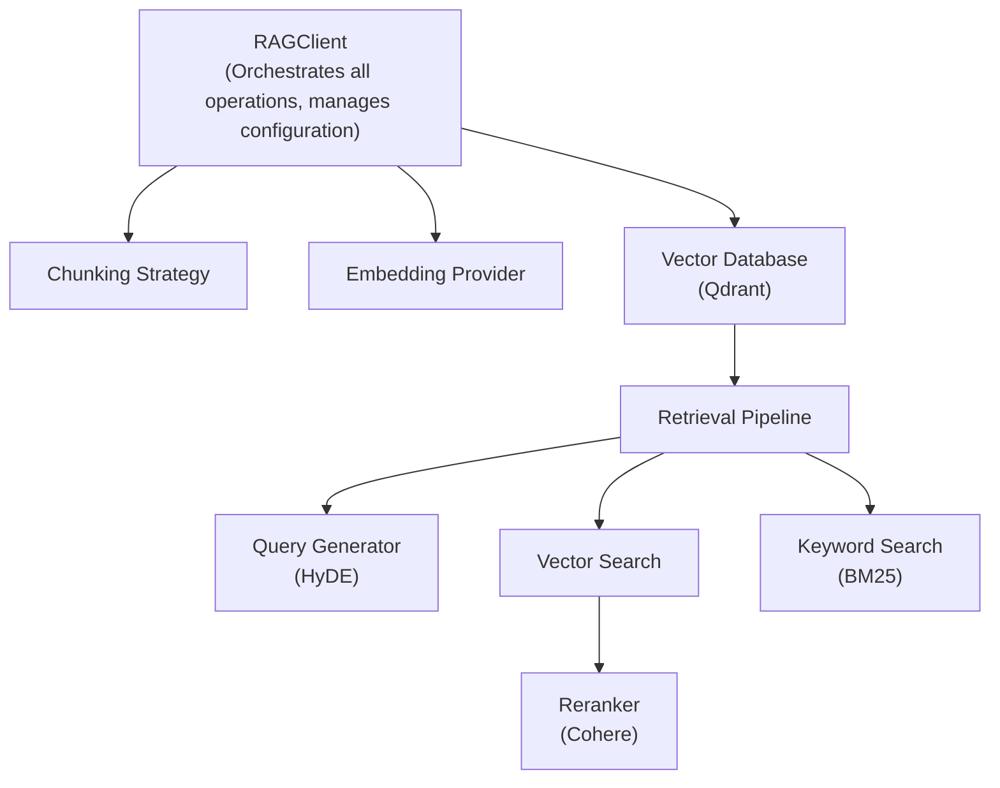
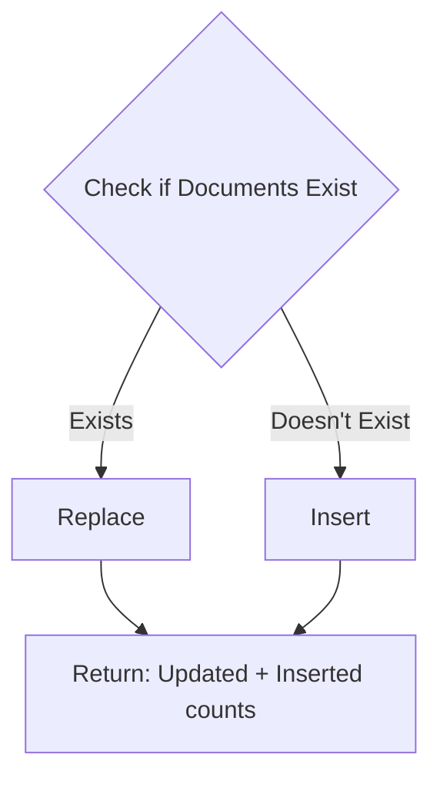

# RAG Library Design for Doc Directors Pipeline

## 1\. Library Architecture

### Overview

The RAG library is designed as a modular, plug-and-play system that abstracts all RAG complexity into three primary operations: **Input**, **Update**, and **Retrieve**. The architecture follows the principle of separation of concerns with clear interfaces between components.

### Core Components

**Module Structure:**

```text
rag_library/
├── core/                      # Central orchestration layer
│   ├── client.py              # Main RAGClient - entry point for all operations
│   └── config.py              # Configuration management and validation
│
├── chunking/                  # Document chunking strategies
│   ├── base.py                # Abstract interface for all chunkers
│   ├── semantic.py            # Semantic chunking (primary method)
│   └── utils.py               # Token counting, text splitting utilities
│
├── embedding/                 # Vector embedding generation
│   ├── base.py                # Abstract interface for embedding providers
│   └── openai.py              # OpenAI text-embedding-3-large implementation
│
├── vectordb/                  # Vector database operations
│   ├── base.py                # Abstract interface for vector stores
│   └── qdrant.py              # Qdrant implementation
│
├── retrieval/                 # Hybrid retrieval system
│   ├── query_generator.py     # Query optimization and HyDE generation
│   ├── vector_search.py       # Semantic similarity search
│   ├── keyword_search.py      # BM25 lexical search
│   └── reranker.py            # Cross-encoder reranking (Cohere)
│
└── models/                    # Data structures
    ├── chunk.py               # Chunk representation and metadata
    ├── document.py            # Document input specifications
    └── response.py            # Standardized API responses
```

### Component Interaction Flow

**High-Level Architecture:**

<!-- ```text
┌─────────────────────────────────────────────────────────────────┐
│                         RAGClient                                │
│  (Orchestrates all operations, manages configuration)            │
└──────────────┬────────────┬──────────────┬──────────────────────┘
               │            │              │
       ┌───────▼────┐  ┌───▼──────┐  ┌───▼─────────────┐
       │ Chunking   │  │Embedding │  │ Vector Database │
       │ Strategy   │  │ Provider │  │    (Qdrant)     │
       └────────────┘  └──────────┘  └─────────────────┘
                                              │
                                     ┌────────▼─────────┐
                                     │  Retrieval       │
                                     │  Pipeline        │
                                     └──────┬───────────┘
                                            │
                      ┌─────────────────────┼─────────────────────┐
                      │                     │                     │
              ┌───────▼────────┐   ┌───────▼────────┐   ┌───────▼────────┐
              │ Query Generator│   │ Vector Search  │   │ Keyword Search │
              │  (HyDE)        │   │                │   │    (BM25)      │
              └────────────────┘   └────────────────┘   └────────────────┘
                                            │
                                    ┌───────▼────────┐
                                    │   Reranker     │
                                    │   (Cohere)     │
                                    └────────────────┘
``` -->



### Design Principles

**1\. Interface-Based Design**

- All major components (chunking, embedding, vector DB, reranking) have abstract base interfaces  
- Enables easy swapping of implementations without affecting client code  
- Future providers can be added by implementing the base interface

**2\. Configuration-Driven Behavior**

- Single configuration object controls all library behavior  
- All parameters have sensible defaults based on research best practices  
- Configuration is validated at initialization to fail fast

**3\. Extensibility Without Breaking Changes**

- New chunking methods, embedding providers, or vector databases can be added  
- Existing code continues to work as new options are introduced  
- Version-controlled feature flags for experimental capabilities

---

## 2\. Core API Operations

The library exposes three primary operations that handle the complete RAG lifecycle:

### 2.1 Library Initialization

**Purpose:** Configure the RAG system with all necessary credentials and parameters.

**Configuration Categories:**

#### A. Vector Database Configuration

- Connection details for Qdrant instance  
- API authentication credentials  
- Collection management settings

#### B. Embedding Configuration

- Provider selection (OpenAI, with future support for Cohere, Azure, etc.)  
- Model specification (default: text-embedding-3-large)  
- Dimensionality settings (3072 dimensions)  
- API credentials

#### C. Reranking Configuration

- Provider selection (Cohere Rerank 3.5, with future cross-encoder support)  
- Model specification  
- API credentials  
- Top-k selection parameters

#### D. LLM Configuration (for Query Generation)

- Provider selection (OpenAI GPT-4, with future Anthropic, Azure support)  
- Model specification  
- API credentials for HyDE query generation

#### E. Chunking Strategy Configuration

- Method selection (semantic chunking as primary)  
- Maximum chunk size (default: 1000 tokens)  
- Overlap percentage (default: 20%)  
- Semantic breakpoint threshold (95th percentile)

#### F. PDF Processing Configuration

- Parser selection (pdfplumber, with future Chunkr, Unstructured.io support)  
- Text extraction settings  
- Quality validation parameters

#### G. Retrieval Configuration

- Vector search limits (25 chunks per query)  
- Keyword search limits (50 BM25 chunks)  
- Feature toggles (HyDE, keyword search)  
- Final reranking top-k (20 chunks)  
- Distance metric (cosine similarity)

**Initialization Flow:**

```text
User Creates Config Object
         ↓
Configuration Validation
    (Check required fields, validate API keys format, verify parameters)
         ↓
Initialize RAGClient
         ↓
Establish Connections
    (Qdrant, OpenAI API, Cohere API)
         ↓
Verify System Health
    (Test connections, validate models available)
         ↓
Client Ready for Operations
```

---

### 2.2 Knowledge Base Input Operation

**Function**: `add_documents()`

**Purpose:** Process documents, create semantic chunks, generate embeddings, and store in vector database.

**Input Parameters:**

1. **documents**: List of document inputs  

   - Accepts files (PDFs), raw text, or binary content  
   - Each document can have individual metadata  
   - Supports batch processing of multiple documents

2. **collection\_name**: Target Qdrant collection  

   - Auto-creates collection if it doesn't exist  
   - Manages collection schema and indexing

3. **metadata**: Global metadata for all chunks  

   - User identification (user\_id)  
   - Document categorization (document\_type, is\_standalone)  
   - Template association (template\_id)  
   - Any custom fields

4. **batch\_size**: Processing batch size (default: 100\)  

   - Controls memory usage during embedding generation  
   - Optimizes API calls to embedding provider

5. **validate\_chunks**: Quality validation toggle (default: True)  

   - Token count validation  
   - Garbled text detection  
   - Minimum length requirements

**Processing Flow:**

```text
Documents Input (PDF/Text/Binary)
         ↓
┌────────────────────────────────┐
│  PHASE 1: Document Loading     │
└────────────────────────────────┘
    - Read files from paths
    - Decode binary content
    - Validate file formats
         ↓
┌────────────────────────────────┐
│  PHASE 2: Text Extraction      │
└────────────────────────────────┘
    - Extract text using pdfplumber (primary)
    - Fallback to PyPDF2 if needed
    - Detect encryption/corruption
    - Validate text quality
         ↓
┌────────────────────────────────┐
│  PHASE 3: Semantic Chunking    │
└────────────────────────────────┘
    - Check if single chunk sufficient
    - Apply semantic boundary detection
    - Enforce token limits (1000 max)
    - Add 20% overlap between chunks
    - Fallback to character-based if needed
         ↓
┌────────────────────────────────┐
│  PHASE 4: Chunk Validation     │
└────────────────────────────────┘
    - Verify token counts
    - Detect garbled text
    - Check minimum length
    - Attach metadata to each chunk
         ↓
┌────────────────────────────────┐
│  PHASE 5: Batch Embedding      │
└────────────────────────────────┘
    - Generate embeddings in batches
    - Use OpenAI text-embedding-3-large
    - 3072-dimensional vectors
    - Rate limit handling
         ↓
┌────────────────────────────────┐
│  PHASE 6: Vector Storage       │
└────────────────────────────────┘
    - Store in Qdrant collection
    - Upsert points with metadata
    - Create indexes if needed
    - Track performance metrics
         ↓
Response: Success with chunk details
```

**Response Data Includes:**

- Success status and document count  
- Total chunks created with individual IDs  
- Complete metadata for each chunk (document\_id, source, chunk\_index, token counts, etc.)  
- Processing statistics (timings, token usage, failures)  
- Any errors encountered during processing

**Error Handling:**

- **PDFEncryptedError**: Password-protected PDFs detected  
- **PDFCorruptedError**: Invalid or damaged PDF files  
- **PDFEmptyError**: No extractable text content  
- **ChunkingError**: Semantic chunking failures  
- **EmbeddingError**: API failures during embedding generation  
- **VectorDBError**: Qdrant connection or storage issues

**Use Cases:**

1. **Business Document Upload**: User-specific PDFs with user\_id metadata  
2. **Website Content Storage**: Scraped text with source URL tracking  
3. **Knowledge Base Creation**: Template-specific documents with template\_id

---

### 2.3 Knowledge Base Update Operation

**Function**: `update_documents()`

**Purpose:** Modify, replace, or delete existing documents in the knowledge base.

**Input Parameters:**

1. **collection\_name**: Target Qdrant collection  

2. **update\_strategy**: Operation type  

   - **replace**: Delete existing documents and add new ones  
   - **append**: Add new documents without deleting  
   - **delete**: Remove documents matching criteria  
   - **upsert**: Update if exists, insert if doesn't

3. **filters**: Metadata-based selection criteria  

   - Filter by user\_id, document\_type, template\_id, etc.  
   - Supports complex filter combinations

4. **document\_ids**: Specific document IDs to target  

   - Alternative to metadata filters  
   - Precise document selection

5. **new\_documents**: Replacement or additional documents  

   - Used with replace, append, and upsert strategies

6. **metadata\_updates**: Metadata field updates  

   - Update metadata without reprocessing content  
   - Useful for status changes, tags, timestamps

7. **reprocess\_chunks**: Content reprocessing toggle  

   - If True: Regenerate chunks and embeddings  
   - If False: Metadata-only updates

**Update Strategies Explained:**

**1\. Replace Strategy**

```text
Identify Target Documents (via filters/IDs)
         ↓
Delete Existing Chunks from Qdrant
         ↓
Process New Documents
         ↓
Create New Chunks with Semantic Chunking
         ↓
Generate New Embeddings
         ↓
Store New Chunks in Qdrant
         ↓
Return: Deleted count + Added count
```

**2\. Append Strategy**

```text
Keep All Existing Documents
         ↓
Process New Documents
         ↓
Create New Chunks
         ↓
Generate Embeddings
         ↓
Add to Collection (No Deletion)
         ↓
Return: Added count
```

**3\. Delete Strategy**

```text
Identify Target Documents (via filters/IDs)
         ↓
Delete All Matching Chunks from Qdrant
         ↓
Clean Up References
         ↓
Return: Deleted count
```

**4\. Upsert Strategy**

<!-- ```text
Check if Documents Exist
         ↓
    ┌───────┴───────┐
    │               │
 Exists        Doesn't Exist
    │               │
 Replace          Insert
    │               │
    └───────┬───────┘
            ↓
Return: Updated + Inserted counts
``` -->



**Response Data Includes:**

- Success status  
- Strategy used  
- Documents affected count  
- Chunks deleted, added, and updated counts  
- List of updated document IDs  
- Any errors encountered

**Error Handling:**

- **CollectionNotFoundError**: Target collection doesn't exist  
- **NoDocumentsFoundError**: No documents match filters/IDs  
- **VectorDBError**: Qdrant operation failures

**Use Cases:**

1. **Document Replacement**: User uploads updated version of existing document  
2. **Metadata Updates**: Mark documents as archived or add tags  
3. **Bulk Deletion**: Remove all documents for a specific user or template  
4. **Incremental Additions**: Add new documents to existing knowledge base

---

### 2.4 Knowledge Base Retrieval Operation

**Function**: `retrieve()`

**Purpose:** Find and return most relevant document chunks using hybrid search with reranking.

**Input Parameters:**

1. **query**: User's search question or query string  

2. **collection\_name**: Target Qdrant collection to search  

3. **filters**: Metadata filters to narrow search scope  

   - Filter by user\_id, template\_id, document\_type, etc.  
   - Ensures user isolation and template-specific retrieval

4. **top\_k**: Final number of chunks to return (default: 20\)  

5. **enable\_reranking**: Use Cohere reranking (default: True)  

   - Improves relevance ranking significantly  
   - Slight latency increase

6. **enable\_keyword\_search**: Include BM25 search (default: True)  

   - Adds lexical matching to semantic search  
   - Better for exact term matches

7. **enable\_hyde**: Use HyDE query generation (default: True)  

   - Generates hypothetical answer for better retrieval  
   - Research-proven improvement

8. **score\_threshold**: Minimum relevance score filter  

   - Optional quality gate for results

9. **return\_full\_chunks**: Return complete vs truncated content  

10. **deduplicate**: Remove duplicate chunks (default: True)

**Retrieval Pipeline Flow:**

```text
User Query
    ↓
┌─────────────────────────────────────────────┐
│  STEP 1: Query Generation                   │
└─────────────────────────────────────────────┘
    - LLM generates optimized search query
    - LLM generates HyDE (hypothetical answer)
    - Single API call using structured output
    - Result: 2 queries (standard + HyDE)
    ↓
┌─────────────────────────────────────────────┐
│  STEP 2: Vector Search                      │
└─────────────────────────────────────────────┘
    - Embed both queries using OpenAI
    - Search Qdrant with each query
    - 25 chunks per query = 50 chunks total
    - Apply metadata filters
    - Track vector similarity scores
    ↓
┌─────────────────────────────────────────────┐
│  STEP 3: Keyword Search (BM25)              │
└─────────────────────────────────────────────┘
    - Tokenize original query
    - BM25 algorithm on document corpus
    - Retrieve 50 additional chunks
    - Lexical matching for exact terms
    - Apply same metadata filters
    ↓
┌─────────────────────────────────────────────┐
│  STEP 4: Combine & Deduplicate              │
└─────────────────────────────────────────────┘
    - Pool: 50 vector + 50 keyword = ~100 chunks
    - Remove duplicates by document_id or content hash
    - Result: ~100 unique chunks
    ↓
┌─────────────────────────────────────────────┐
│  STEP 5: Reranking                          │
└─────────────────────────────────────────────┘
    - Send all unique chunks to Cohere Rerank 3.5
    - Cross-encoder scoring for relevance
    - Considers query-chunk semantic relationship
    - Produces 0-1 relevance scores
    ↓

┌─────────────────────────────────────────────┐
│  STEP 6: Selection & Formatting             │
└─────────────────────────────────────────────┘
    - Sort by reranker scores (highest first)
    - Select top_k chunks (default: 20)
    - Apply score_threshold if specified
    - Return full chunks (no truncation)
    - Include all metadata and scores
    ↓
Response: Top-k relevant chunks with scores
```

**Response Data Includes:**

1. **Success status and original query**  

2. **Generated queries**: Standard and HyDE queries used  

3. **Retrieved chunks** (for each chunk):  

   - Full content text  
   - Complete metadata (source, document\_id, chunk\_index, etc.)  
   - Relevance score (from reranker, 0-1)  
   - Vector similarity score  
   - BM25 keyword score (if applicable)  
   - Rank position (1 to top\_k)

4. **Retrieval statistics**:  

   - Total chunks retrieved (before dedup/reranking)  
   - Vector search chunk count  
   - Keyword search chunk count  
   - Chunks after deduplication  
   - Chunks after reranking  
   - Timing breakdown:  
     - Query generation time  
     - Vector search time  
     - Keyword search time  
     - Reranking time  
     - Total time

5. **Source information**:  

   - List of source documents  
   - Chunk count per source  
   - Average relevance per source

**Error Handling:**

- **CollectionNotFoundError**: Collection doesn't exist  
- **QueryGenerationError**: LLM query generation failure  
- **EmbeddingError**: Query embedding failure  
- **RerankingError**: Cohere API issues  
- **VectorDBError**: Qdrant search failures

**Retrieval Modes:**

**1\. Full Hybrid (Default \- Best Quality)**

- HyDE enabled \+ Vector search \+ Keyword search \+ Reranking  
- Retrieves \~100 chunks, reranks to top 20  
- Best accuracy, slightly higher latency

**2\. Hybrid Without HyDE**

- Standard vector \+ Keyword search \+ Reranking  
- Faster query generation, still excellent results

**3\. Vector Only with Reranking**

- Pure semantic search \+ Reranking  
- Good for conceptual queries, misses exact terms

**4\. Fast Vector Search**

- Vector search only, no reranking, no keyword  
- Fastest retrieval, lower accuracy  
- Good for preview/suggestion use cases

**Use Cases:**

1. **Document Generation Context**: Retrieve business documents for AI writing  
2. **Question Answering**: Find specific information from knowledge base  
3. **Template-Specific Retrieval**: Get template-associated knowledge  
4. **User-Specific Search**: Find documents belonging to specific user

---

## 3\. Data Models

### 3.1 Core Data Structures

#### DocumentInput

- Represents an input document for processing  
- Fields:  
  - `source`: File path, text string, or binary content  
  - `source_type`: "file", "text", or "binary"  
  - `metadata`: Optional document-specific metadata  
  - `custom_chunking`: Optional chunking override settings

#### Chunk

- Represents a processed document chunk  
- Fields:  
  - `chunk_id`: Unique internal identifier  
  - `vector_id`: Qdrant point ID  
  - `content`: Chunk text content  
  - `metadata`: ChunkMetadata object  
  - `embedding_dimensions`: Vector dimension count

#### ChunkMetadata

- Complete metadata for a chunk  
- Fields:  
  - `document_id`: Parent document identifier  
  - `source`: Original source file/URL  
  - `chunk_index`: Position in document  
  - `total_chunks`: Total chunks in document  
  - `token_count`: Number of tokens  
  - `char_count`: Character count  
  - `chunking_method`: Method used (e.g., "semantic")  
  - `extraction_date`: Timestamp  
  - `custom_fields`: Dictionary of additional metadata

### 3.2 Response Models

#### AddDocumentsResponse

- Result from adding documents  
- Fields:  
  - `success`: Boolean status  
  - `documents_processed`: Count of documents  
  - `total_chunks`: Total chunks created  
  - `chunks`: List of Chunk objects  
  - `processing_stats`: ProcessingStats object  
  - `errors`: List of error messages

#### ProcessingStats

- Performance metrics for document processing  
- Fields:  
  - `total_tokens`: Total tokens processed  
  - `embedding_time_ms`: Time for embedding generation  
  - `chunking_time_ms`: Time for chunking  
  - `upload_time_ms`: Time for Qdrant upload  
  - `failed_chunks`: Count of failed chunks

#### UpdateDocumentsResponse

- Result from update operations  
- Fields:  
  - `success`: Boolean status  
  - `strategy_used`: Update strategy applied  
  - `documents_affected`: Count of affected documents  
  - `chunks_deleted`: Chunks removed  
  - `chunks_added`: Chunks added  
  - `chunks_updated`: Chunks modified  
  - `updated_document_ids`: List of affected IDs  
  - `errors`: Error list

#### RetrievalResponse

- Result from retrieval operations  
- Fields:  
  - `success`: Boolean status  
  - `query_original`: Original query string  
  - `queries_generated`: Dict with standard and HyDE queries  
  - `chunks`: List of RetrievedChunk objects  
  - `retrieval_stats`: RetrievalStats object  
  - `sources`: List of SourceInfo objects

#### RetrievedChunk

- A chunk returned from retrieval  
- Fields:  
  - `content`: Chunk text  
  - `metadata`: ChunkMetadata  
  - `relevance_score`: Reranker score (0-1)  
  - `vector_score`: Cosine similarity score  
  - `keyword_score`: BM25 score (optional)  
  - `rank`: Position in results

#### RetrievalStats

- Performance and count metrics for retrieval  
- Fields:  
  - `total_chunks_retrieved`: Initial retrieval count  
  - `vector_search_chunks`: From vector search  
  - `keyword_search_chunks`: From BM25 search  
  - `chunks_after_dedup`: After deduplication  
  - `chunks_after_reranking`: Final count  
  - Timing fields for each stage

#### SourceInfo

- Aggregated information per source document  
- Fields:  
  - `source`: Source document name  
  - `chunks_count`: Chunks from this source  
  - `avg_relevance`: Average relevance score

---

## 4\. Implementation Best Practices

### 4.1 Semantic Chunking Strategy

**Philosophy:** Semantic chunking splits documents at natural topic boundaries rather than arbitrary character counts, preserving contextual coherence.

**Implementation Approach:**

#### Step 1: Single Chunk Optimization

- Check if entire document ≤ max\_chunk\_size (1000 tokens)  
- If yes, return as single chunk (no splitting)  
- Reduces unnecessary overhead for short documents

#### Step 2: Semantic Boundary Detection

- Generate embeddings for sentences or paragraphs  
- Calculate similarity between adjacent segments  
- Identify low-similarity points (topic transitions)  
- Use percentile-based threshold (95th percentile default)  
- Split at these natural boundaries

#### Step 3: Token Limit Enforcement

- If any semantic chunk \> 1000 tokens  
- Split oversized chunks using RecursiveCharacterTextSplitter  
- Maintains strict token limits for embedding model  
- Preserves semantic boundaries where possible

#### Step 4: Overlap Addition

- Add 20% overlap between adjacent chunks  
- Preserves context at boundaries  
- Helps with retrieval accuracy  
- Ensures no information loss at splits

#### Step 5: Fallback Strategy

- If semantic chunking fails (embedding errors, etc.)  
- Use RecursiveCharacterTextSplitter  
- Chunk size: 1000 characters  
- Overlap: 200 characters (20%)  
- Separators: \["\\n\\n", "\\n", ". ", " ", ""\]

**Benefits:**

- Better context preservation  
- Improved retrieval accuracy  
- Natural information boundaries  
- Flexible chunk sizes based on content

**Metadata Tracking:**

- Record chunking method used  
- Store token and character counts  
- Track chunk position in document  
- Enable analysis and optimization

---

### 4.2 Hybrid Retrieval Pipeline

**Philosophy:** Combine multiple retrieval strategies to maximize both semantic understanding and exact term matching, then use reranking to select the best results.

**Component Breakdown:**

#### 1\. Query Generation with HyDE

**Standard Query:**

- Direct optimization of user's query  
- Remove stop words, normalize terms  
- Expand abbreviations if needed

**HyDE Query:**

- LLM generates hypothetical answer to query  
- Embed the answer instead of the question  
- Research shows 30%+ improvement in retrieval  
- Works because answers are semantically similar to actual answers

**Single LLM Call:**

- Use structured output (JSON mode)  
- Request both queries in one call  
- Reduces latency and API costs  
- Ensures consistency

#### 2\. Vector Search

**Dual Query Search:**

- Search with standard query → 25 chunks  
- Search with HyDE query → 25 chunks  
- Total: 50 chunks from vector search

**Cosine Similarity:**

- Distance metric for semantic similarity  
- Range: \-1 to 1 (typically 0.5 to 1 for relevant)  
- Fast computation on Qdrant

**Metadata Filtering:**

- Apply before search (not post-filter)  
- Ensures search efficiency  
- User isolation, template filtering

#### 3\. Keyword Search (BM25)

**BM25 Algorithm:**

- Best practice for lexical search  
- Term frequency / Inverse document frequency  
- Handles exact term matches  
- Complements semantic search

**Retrieval Count:**

- Get 50 chunks via BM25  
- Same metadata filters applied  
- Catches terms missed by embeddings  
- Essential for names, codes, IDs

#### 4\. Deduplication

**Why Needed:**

- Vector and keyword search overlap  
- Same chunk may score well in both  
- Reduces reranking cost

**Method:**

- Hash-based deduplication on content  
- Or document\_id \+ chunk\_index  
- Keep highest score variant  
- Result: \~100 unique chunks

#### 5\. Reranking

**Cohere Rerank 3.5:**

- Cross-encoder model  
- Scores query-chunk relevance  
- More accurate than embedding similarity  
- 0-1 relevance scores

**Why It Works:**

- Considers full query-chunk interaction  
- Not limited by embedding dimensions  
- Trained specifically for relevance ranking  
- Research-proven improvement

**Process:**

- Send all \~100 chunks to Cohere  
- API returns relevance scores  
- Sort by score  
- Select top\_k (default: 20\)

#### 6\. Final Selection

**No Truncation:**

- Return full chunks (not truncated)  
- Preserves complete context  
- Critical for generation quality

**Score Preservation:**

- Include all scores (vector, keyword, reranker)  
- Enables debugging and analysis  
- Supports confidence thresholds

**Comprehensive Stats:**

- Track timing for each stage  
- Count chunks at each step  
- Identify bottlenecks  
- Optimize future queries

---

### 4.3 Metadata Management

**Philosophy:** Rich metadata enables precise filtering, performance analysis, and system observability.

**Document-Level Metadata:**

- `user_id`: User isolation and ownership  
- `document_type`: Categorization (business\_document, knowledge\_base)  
- `is_standalone`: Lifecycle management (profile vs standalone)  
- `template_id`: Template association for filtering  
- `source_type`: Origin indicator (PDF, Website, Text)

**Chunk-Level Metadata:**

- `document_id`: Parent document reference  
- `chunk_index`: Position in document  
- `total_chunks`: Document size context  
- `token_count`: Size tracking  
- `char_count`: Alternative size metric  
- `chunking_method`: Processing history  
- `extraction_date`: Timestamp for freshness

**Custom Metadata:**

- Extensible dictionary for application-specific fields  
- Examples: `document_name`, `website_url`, `status`, `tags`  
- Enables flexible filtering and organization  
- No schema restrictions

**Metadata Usage:**

**Filtering:**

- User isolation: `{"user_id": "user_123"}`  
- Template-specific: `{"template_id": "template_456"}`  
- Document type: `{"document_type": "business_document"}`  
- Combined filters: `{"user_id": "user_123", "is_standalone": true}`

**Analytics:**

- Track chunking performance by method  
- Monitor token usage per user  
- Analyze source distribution  
- Identify optimal chunk sizes

**Lifecycle Management:**

- Cascade deletes based on `is_standalone`  
- Archive documents by status  
- Update timestamps for freshness  
- Version control via custom fields

---

### 4.4 Error Handling Strategy

**Philosophy:** Fail fast with clear error messages, but degrade gracefully where possible.

**Error Categories:**

**1\. Input Validation Errors (Fail Fast)**

- Invalid API keys → Raise at initialization  
- Missing required parameters → Raise before processing  
- Invalid file formats → Raise with specific error type  
- Prevents wasted processing

**2\. Processing Errors (Retry with Fallback)**

- PDF extraction failure → Try alternative parser  
- Semantic chunking failure → Fallback to character-based  
- Embedding API rate limit → Exponential backoff retry  
- Partial success where possible

**3\. Storage Errors (Transactional)**

- Qdrant connection failure → Roll back operation  
- Partial upload failure → Mark failed chunks  
- Network timeout → Retry with backoff  
- Ensure consistency

**4\. Retrieval Errors (Graceful Degradation)**

- Reranking failure → Return vector-sorted results  
- Keyword search failure → Vector-only results  
- HyDE generation failure → Standard query only  
- Never return empty results if any method succeeds

**Error Response Structure:**

- Clear error type classification  
- Descriptive message for debugging  
- Context (document ID, chunk index, etc.)  
- Actionable guidance for resolution

---

## 5\. Extension Points

### 5.1 Adding New Chunking Methods

**Interface:** All chunkers implement `BaseChunker` interface

**Required Methods:**

- `chunk(text: str) -> List[Chunk]`  
- `validate_config(config: Dict) -> bool`

**Future Additions:**

- Recursive character chunking  
- Fixed-size chunking  
- Markdown-aware chunking  
- Code-specific chunking

**Configuration:**

- Add new `chunking_method` option  
- Method-specific parameters in config  
- Backward compatible defaults

---

### 5.2 Adding New Embedding Providers

**Interface:** All embedders implement `BaseEmbedder` interface

**Required Methods:**

- `embed(texts: List[str]) -> List[Vector]`  
- `get_dimensions() -> int`

**Future Additions:**

- Cohere embeddings  
- Azure OpenAI embeddings  
- Anthropic embeddings  
- Local embedding models

**Configuration:**

- Add `embedding_provider` option  
- Provider-specific credentials  
- Model selection per provider

---

### 5.3 Adding New Vector Databases

**Interface:** All vector DBs implement `BaseVectorDB` interface

**Required Methods:**

- `create_collection(name: str, dimensions: int)`  
- `upsert(collection: str, points: List[Point])`  
- `search(collection: str, query_vector: Vector, filters: Dict) -> List[Result]`  
- `delete(collection: str, filters: Dict)`

**Future Additions:**

- Pinecone  
- Weaviate  
- Milvus  
- ChromaDB

**Configuration:**

- Add `vector_db_provider` option  
- Provider-specific connection details  
- Migrate existing data between providers

---

### 5.4 Adding New Rerankers

**Interface:** All rerankers implement `BaseReranker` interface

**Required Methods:**

- `rerank(query: str, chunks: List[Chunk], top_k: int) -> List[ScoredChunk]`

**Future Additions:**

- Cross-encoder models (local)  
- Anthropic Claude reranking  
- Custom fine-tuned models

**Configuration:**

- Add `reranker_provider` option  
- Model selection  
- Custom model loading paths

---

## 6\. Performance Considerations

**Query Generation:**

- Single LLM call for standard \+ HyDE queries  
- Structured output for parsing efficiency  
- Cache common query patterns

**Vector Search:**

- Parallel searches for multiple queries  
- Efficient metadata filtering in Qdrant  
- Index optimization (HNSW algorithm)

**Keyword Search:**

- Pre-computed BM25 indexes  
- Incremental index updates  
- Cache for frequent queries

**Reranking:**

- Batch API calls where possible  
- Limit candidate set size (\~100 chunks)  
- Parallel processing for multiple queries
