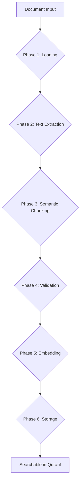

# Guide: Document Management

This guide covers the complete lifecycle of documents in `insta_rag`, from initial ingestion and processing to updating and deleting them.

## Part 1: Adding Documents (`add_documents`)

The `add_documents()` method is the entry point for adding new knowledge to your RAG system. It orchestrates a sophisticated 6-phase pipeline to process raw documents into searchable vector embeddings.

### The Ingestion Pipeline



#### **Phase 1: Document Loading**

- **Input**: A list of `DocumentInput` objects (from files, text, or binary).
- **Action**: A unique `document_id` is generated, and metadata is consolidated.

#### **Phase 2: Text Extraction**

- **Action**: For PDF files, text is extracted page-by-page. The system uses `pdfplumber` and falls back to `PyPDF2` if needed. It also handles encrypted or corrupted files.

#### **Phase 3: Semantic Chunking**

- **Goal**: To split documents at natural topic boundaries, preserving context.
- **Process**:
  1. If a document is small (e.g., \<= 1000 tokens), it's treated as a single chunk.
  1. Otherwise, the text is split into sentences.
  1. Embeddings are generated for each sentence.
  1. The cosine similarity between adjacent sentences is calculated.
  1. Low-similarity points are identified as "breakpoints" or topic changes.
  1. The text is split at these breakpoints.
  1. A 20% overlap is added between chunks to ensure no context is lost at the boundaries.

#### **Phase 4: Chunk Validation**

- **Action**: Each chunk is validated for quality (e.g., minimum length) and a `ChunkMetadata` object is created, containing token counts, source information, and other useful data.

#### **Phase 5: Batch Embedding Generation**

- **Action**: The content of all chunks is sent to the configured embedding provider (e.g., Azure OpenAI) in batches.
- **Output**: Each chunk is associated with a high-dimensional vector embedding (e.g., 3072 dimensions for `text-embedding-3-large`).

#### **Phase 6: Storage**

- **Action**: The chunks (embeddings and metadata) are uploaded to the specified Qdrant collection.
- **ID Generation**: A deterministic UUID is generated for each chunk, ensuring that re-uploading the same chunk is an idempotent operation.
- **Hybrid Storage**: If MongoDB is configured, the full text content is stored in MongoDB, while Qdrant stores only the vector and a reference ID to the MongoDB document. This is the recommended setup for production. See the [Storage Backends Guide](https://github.com/AI-Buddy-Catalyst-Labs/insta_rag/blob/main/docs/guides/storage-backends.md) for more details.

### Example: Adding a Document

```python
from insta_rag import RAGClient, RAGConfig, DocumentInput

config = RAGConfig.from_env()
client = RAGClient(config)

documents = [
    DocumentInput.from_file(
        "./annual-report.pdf", metadata={"year": 2024, "company": "InstaCo"}
    )
]

response = client.add_documents(
    documents=documents, collection_name="financial_reports"
)

print(f"Successfully created {response.total_chunks} chunks.")
```

______________________________________________________________________

## Part 2: Updating and Deleting Documents (`update_documents`)

The `update_documents()` method provides flexible CRUD (Create, Read, Update, Delete) operations for managing your knowledge base after initial ingestion.

### Update Strategies

You can choose one of four strategies for any update operation.

#### 1. `replace`

- **Action**: Deletes a set of existing documents and adds a new set in their place.
- **Use Case**: A user uploads a new version of a document that should completely replace the old one.

```python
# Replace all documents from 2023 with the new 2024 report
response = client.update_documents(
    collection_name="financial_reports",
    update_strategy="replace",
    filters={"year": 2023, "company": "InstaCo"},
    new_documents=[DocumentInput.from_file("./new-report.pdf")],
)
```

#### 2. `append`

- **Action**: Adds new documents to a collection without affecting existing ones.
- **Use Case**: Incrementally adding new information to a knowledge base.

```python
# Add a new quarterly report without touching the old ones
response = client.update_documents(
    collection_name="financial_reports",
    update_strategy="append",
    new_documents=[DocumentInput.from_file("./q3-report.pdf")],
)
```

#### 3. `delete`

- **Action**: Removes documents and their associated chunks from the knowledge base.
- **Use Case**: Removing outdated, irrelevant, or incorrect information.

```python
# Delete by metadata filter
response = client.update_documents(
    collection_name="financial_reports",
    update_strategy="delete",
    filters={"status": "archived"},
)

# Or delete by specific document IDs
response = client.update_documents(
    collection_name="financial_reports",
    update_strategy="delete",
    document_ids=["doc-id-123", "doc-id-456"],
)
```

#### 4. `upsert`

- **Action**: Updates documents if they exist (based on `document_id` in metadata), or inserts them if they don't.
- **Use Case**: Synchronizing data from an external source where you want to ensure the latest version is present without creating duplicates.

```python
# Documents with explicit IDs for upserting
docs_to_sync = [
    DocumentInput.from_text(
        "Profile for user 1", metadata={"document_id": "user-profile-1"}
    ),
    DocumentInput.from_text(
        "Profile for user 2", metadata={"document_id": "user-profile-2"}
    ),
]

response = client.update_documents(
    collection_name="user_profiles",
    update_strategy="upsert",
    new_documents=docs_to_sync,
)
```

### Metadata-Only Updates

If you only need to change the metadata of existing chunks without the overhead of re-chunking and re-embedding, set `reprocess_chunks=False`.

This is highly efficient for tasks like changing a document's status, adding tags, or updating timestamps.

```python
# Mark all reports from 2023 as archived without reprocessing them
response = client.update_documents(
    collection_name="financial_reports",
    update_strategy="delete",  # Strategy is ignored here
    filters={"year": 2023},
    metadata_updates={"status": "archived"},
    reprocess_chunks=False,  # This is the key parameter
)

print(f"Updated metadata for {response.chunks_updated} chunks.")
```
